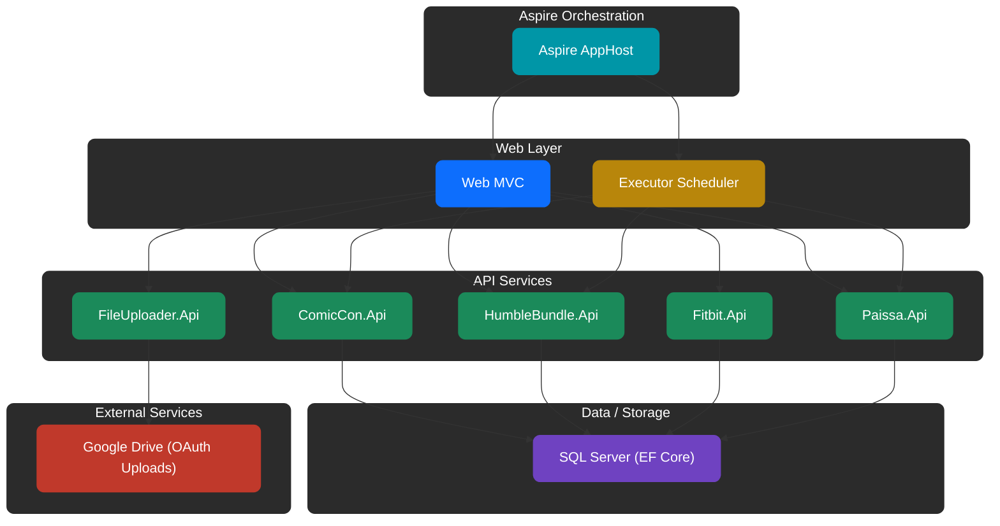

# Tomeshelf
Tomeshelf is a data-aggregation platform built on .NET 10 and orchestrated with Aspire. It collects information from Comic Con, Humble Bundle, Fitbit, and FFXIV housing, processes it through a suite of targeted ASP.NET Core APIs, and surfaces everything through a unified MVC web front end. A scheduler ingests external feeds, builds curated bundles, and uploads them to Google Drive via OAuth. The system uses EF Core with SQL Server for persistence, includes full observability through health checks and OpenTelemetry, and is designed for clean, predictable local orchestration with Aspire.

## Status
### Pipeline

### Code Quality (SonarCloud)

### Code Health

## Tech Stack
- **.NET 10** – Core runtime and framework  
- **Aspire** – Orchestration, config, and service wiring  
- **ASP.NET Core** – APIs + MVC front end  
- **Quartz.NET** – Scheduler for ingest and refresh jobs  
- **EF Core + SQL Server** – Storage and querying  
- **Google Drive API (OAuth)** – Bundle uploads  
- **OpenTelemetry** – Tracing, instrumentation, health checks  
- **Docker / Aspire Compose** – Local container environment  

## Features
### Aspire Orchestration
- **Aspire AppHost** – Coordinates all services, manages service discovery, configuration, and local orchestration.
### Web Layer
- **Web (MVC)** – Unified front end that surfaces data from all APIs and drives Google Drive upload workflows.
- **Executor (Scheduler)** – Aspire-managed Quartz scheduler that runs cron-based ingestion, refresh, and upload tasks.
### API Services
- **ComicCon.Api** – Ingests Comic Con guest data, persists it via EF Core, and provides searchable listings.
- **HumbleBundle.Api** – Fetches Humble Bundle metadata, builds archives, and hands them off to the uploader.
- **FileUploader.Api** – OAuth-secured Google Drive uploader supporting large resumable uploads.
- **Fitbit.Api** – Proxies Fitbit data retrieval and stores activity metrics.
- **Paissa.Api** – Surfaces FFXIV housing data for selected worlds.
### Data & Storage
- **SQL Server (EF Core)** – Primary persistence engine for the platform.
### External Services
- **Google Drive** – OAuth-protected destination for curated bundle uploads.

## Structure Diagram
